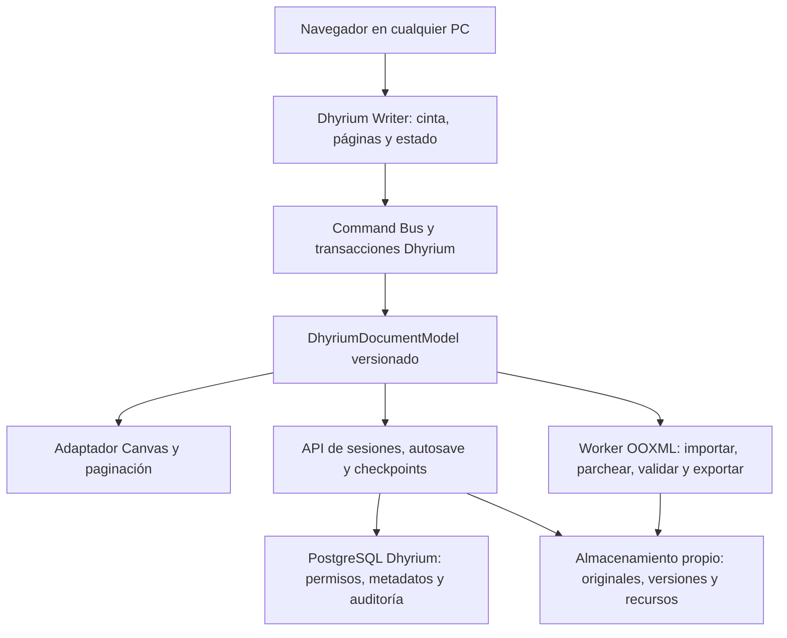

# Investigación: Dhyrium Writer nativo e independiente

Fecha de corte: 2026-08-11

## 1. Objetivo confirmado

El nuevo objetivo reemplaza la propuesta de Microsoft Word de escritorio:

- editar desde cualquier PC de la red usando solamente un navegador;
- no requerir Microsoft Word instalado;
- no usar Microsoft 365, SharePoint, OneDrive, Graph ni una base de datos Microsoft;
- no usar ONLYOFFICE, Collabora u otra suite ofimática como motor de producción;
- conservar los datos, permisos, versiones y archivos en infraestructura Dhyrium;
- tomar como referencia la organización y el flujo de un procesador de texto
  moderno, sin copiar marca ni afirmar que Dhyrium es Microsoft Word;
- abrir, modificar y volver a guardar archivos `.docx` mediante código propio y
  componentes abiertos auditables.

Sí es viable construir este producto. No es responsable prometer desde el primer
hito todas las funciones de Word ni una paginación idéntica para cualquier DOCX.
La solución debe publicar una matriz de compatibilidad por niveles y conservar,
sin corrupción, todo lo que todavía no pueda editar.

## 2. Base técnica independiente

DOCX no necesita Microsoft Office para ser leído o escrito. Es un paquete Open
Packaging Conventions, normalmente ZIP, con partes XML y binarias relacionadas.
Su contrato público es [ECMA-376](https://ecma-international.org/publications-and-standards/standards/ecma-376/)
y [ISO/IEC 29500](https://www.iso.org/standard/71691.html).

Un documento puede contener, entre otras partes:

- `word/document.xml`;
- estilos, temas, fuentes y numeración;
- configuraciones y propiedades;
- encabezados, pies, notas y comentarios;
- imágenes, gráficos, objetos y relaciones;
- extensiones Strict, Transitional y `mc:AlternateContent`.

Por eso DOCX no puede tratarse como HTML con extensión `.docx`. El estándar
define el archivo, pero no proporciona un motor de selección, comandos,
tipografía o paginación. Esas capacidades deben pertenecer a Dhyrium Writer.

## 3. Diagnóstico del producto actual

### Capacidades reutilizables

El repositorio ya contiene un editor web independiente en
`TaskDocumentEditor.tsx`, basado en `@hufe921/canvas-editor` 1.0.0, licencia MIT.
Actualmente aporta:

- caret, selección y escritura;
- páginas, regla, encabezado y pie;
- deshacer y rehacer nativos;
- texto, tablas, imágenes, enlaces y saltos;
- paginación Canvas y zoom;
- registro de comandos y adaptador de estado;
- cinta Dhyrium con comandos de Inicio;
- autoguardado, revisión optimista y versiones en PostgreSQL.

`TaskPrincipal.tsx` monta actualmente esta superficie Canvas. En cambio,
`OfficeTaskDocumentEditor` ya no tiene consumidores en `src/`. Por tanto, no se
parte desde cero: existe un núcleo editable, aunque todavía no puede considerarse
un editor DOCX seguro.

La pestaña Inicio registra 36 comandos. Treinta y uno invocan acciones reales del
motor y cinco están bloqueados deliberadamente: lista multinivel, aumentar o
disminuir sangría, sombreado y bordes de párrafo. El metadato
`undoTransaction` todavía no agrupa operaciones compuestas en una única
transacción.

Los siguientes componentes son una base útil:

- `TaskDocumentEditor` y el ciclo de vida del Canvas;
- `CanvasWordRibbon` y `RibbonSchema`;
- `CommandRegistry`, `RibbonRuntime` y `EditorStateAdapter`;
- servicios de documento, control de revisión y versiones;
- almacenamiento de recursos e historial inmutable.

### Bloqueo principal: importación y exportación

La importación actual usa Mammoth para convertir DOCX a HTML, DOMPurify para
sanearlo y Canvas Editor para reconstruir el contenido. Mammoth declara que
produce HTML semántico limpio e ignora detalles visuales; también advierte que
la conversión de documentos complejos no será perfecta.
[Fuente oficial](https://github.com/mwilliamson/mammoth.js/).

La exportación actual utiliza `html-docx-js-typescript`. Genera un `altChunk` MHT
y no un árbol WordprocessingML nativo. El ensayo local demostró la pérdida:

| Métrica                 |    DOCX original | Exportación actual |
| ----------------------- | ---------------: | -----------------: |
| Partes OPC              |               19 |                  5 |
| Relaciones              |               16 |                  2 |
| Encabezados             |                3 |                  0 |
| Pies                    |                3 |                  0 |
| Tablas WordprocessingML |                8 |                  0 |
| Formato de página       | A4 personalizado |      Letter, 72 pt |
| Estructura principal    |     OOXML nativo |   `w:altChunk` MHT |

Word pudo abrir la reconstrucción, pero marcó el documento como no guardado y
perdió encabezado, pie y configuración de página. Por tanto, este pipeline solo
sirve para exportación de conveniencia; nunca debe guardar el DOCX canónico.

El PDF del editor se genera hoy desde HTML y no desde las páginas Canvas. La
vista previa backend puede invocar Word o `soffice`/LibreOffice. Ambas rutas deben
salir del flujo soberano: el PDF futuro debe ensamblarse desde el render del motor
Dhyrium y verificarse contra las mismas páginas visibles.

El plugin DOCX oficial de Canvas Editor tampoco resuelve este problema: depende
de Mammoth para importar y de `docx` para crear un paquete nuevo. No preserva el
paquete original ni las extensiones desconocidas.

### Contratos contradictorios

El código actual vuelve a montar `TaskDocumentEditor`, pero README, PLAN
REV-29–32, ADR y varias pruebas todavía declaran Word Desktop como motor
canónico. Otras pruebas exigen Canvas. Antes de implementar el nuevo motor debe
aprobarse una revisión de producto que sustituya expresamente el contrato Word
Desktop y elimine las pruebas contradictorias.

### Riesgo de autorización

Las rutas Canvas de lectura, escritura, versiones y recursos solo pasan por la
autenticación general. No aplican la política de tarea que sí utiliza el módulo
Office. Un usuario autenticado que conozca un `taskId` podría alcanzar datos o
escrituras que no le correspondan. Este es un bloqueo P0 y debe corregirse antes
de convertir Canvas en superficie canónica.

Además, `/uploads` y `/task-document-assets` se exponen como archivos estáticos
sin autorización contextual. Los recursos deben identificarse por `assetId`,
validar el permiso del documento y entregarse mediante una ruta autorizada o una
URL firmada breve.

El modelo Canvas se guarda directamente como `IEditorData`, el backend acepta
varios nodos internos como valores desconocidos y la tarea no conserva una
identidad documental inequívoca por `sourceFileId`. También existen dos líneas de
versionado separadas, JSON y DOCX. El nuevo contrato debe resolver documento,
fuente, head y versiones mediante un único `documentId`.

## 4. Alternativas evaluadas

| Alternativa                                      | Fortalezas                                                         | Límites                                                                                | Decisión                                           |
| ------------------------------------------------ | ------------------------------------------------------------------ | -------------------------------------------------------------------------------------- | -------------------------------------------------- |
| Construir entrada, selección y layout desde cero | Control total                                                      | Reimplementar IME, bidi, portapapeles, accesibilidad, tablas y paginación consume años | Rechazada para la urgencia                         |
| Canvas Editor MIT auditado y encapsulado         | Ya está integrado; paginación y comandos reales                    | Modelo y DOCX no son suficientemente fieles; accesibilidad/IME deben probarse          | Núcleo visual provisional recomendado              |
| ProseMirror/Tiptap MIT                           | Modelo, transacciones, selección, historial y colaboración maduros | No incluye paginación Word ni round-trip DOCX                                          | Alternativa de respaldo y referencia transaccional |
| Paged.js                                         | Paginación HTML/CSS y PDF                                          | No es editor ni intérprete DOCX                                                        | Solo herramienta auxiliar                          |
| docx4j Apache-2.0                                | Manipula paquetes OOXML completos en Java                          | Añade un runtime/servicio Java; no es motor visual                                     | Validador/manipulador opcional de laboratorio      |
| Apache POI XWPF                                  | Lectura/escritura DOCX en Java                                     | Su propia documentación declara soporte moderado e incompleto                          | No usar como autoridad                             |
| LibreOfficeKit/Collabora/OnlyOffice              | Compatibilidad de suite madura                                     | Dependencia de otra suite, fuera del requisito                                         | Rechazada para producción                          |
| Motor completo propietario nuevo                 | Máxima independencia                                               | Programa plurianual antes de lograr entrada y layout estables                          | Evolución posible, no primer corte                 |

[Canvas Editor](https://github.com/Hufe921/canvas-editor) es MIT y ofrece un
pipeline Canvas controlado. [ProseMirror](https://prosemirror.net/docs/guide/)
también es abierto y define un modelo inmutable con transacciones, comandos,
historial y colaboración, pero se presenta como un conjunto modular y no como un
procesador paginado listo para usar.

Independencia no debe confundirse con reimplementar desde cero la entrada de
teclado, Unicode o la selección. Una biblioteca MIT fijada, auditada y aislada
detrás de interfaces Dhyrium no realiza llamadas externas ni controla los datos.
El modelo, los comandos, el bridge OOXML, la persistencia y las decisiones de
producto sí deben ser propiedad de Dhyrium.

## 5. Arquitectura recomendada



No se recomienda que el JSON interno de Canvas, HTML o PDF sea la única fuente
canónica. La autoridad se compone de:

1. DOCX original inmutable;
2. grafo OPC completo;
3. modelo Dhyrium versionado;
4. referencias entre nodos Dhyrium y fragmentos OOXML;
5. operaciones y checkpoints;
6. fragmentos opacos no soportados.

### Interfaz del motor

```ts
interface DhyriumDocumentEngine {
  open(input: ArrayBuffer): Promise<OpenDocumentResult>;
  getState(): DhyriumDocumentState;
  dispatch<T>(command: DhyriumCommand<T>, payload: T): DocumentTransaction;
  validate(): Promise<ValidationReport>;
  exportDocx(options: { preserveOpaqueParts: true }): Promise<ArrayBuffer>;
}

interface DhyriumCommand<T> {
  id: string;
  canExecute(context: EditorContext): boolean;
  isActive(context: EditorContext): boolean;
  getValue(context: EditorContext): unknown;
  execute(context: EditorContext, payload: T): DocumentTransaction;
}
```

La cinta no debe invocar directamente métodos Canvas. Todo botón genera una
transacción con selección inicial, pasos, operación inversa, autor, versión base
y regiones que deben repaginarse. Esto permite undo/redo coherente, auditoría y
una futura sustitución del renderer.

## 6. Modelo documental

```text
Document
 ├─ metadata, styles, theme, numbering, settings
 ├─ resources: images, fonts, relationships
 └─ sections[]
      ├─ pageSize, orientation, margins, columns
      ├─ headers[] / footers[]
      └─ blocks[]
           ├─ paragraph
           │    └─ runs: text, tab, break, hyperlink, image, field
           ├─ table / row / cell
           ├─ pageBreak / sectionBreak
           ├─ contentControl
           └─ opaqueBlock
```

Cada nodo necesita ID estable, propiedades directas, estilo heredado, parte y
relación OOXML de origen, hash, atributos/extensiones desconocidos y uno de estos
estados:

- `supported`: se puede leer, editar y exportar;
- `preserved`: no se edita, pero se conserva intacto;
- `flattened`: se convierte solo con consentimiento explícito;
- `blocked`: no se permite editar o ejecutar.

Las medidas deben conservarse en twips y EMU. Los píxeles son una proyección de
pantalla, no el dato documental.

## 7. Importación DOCX segura

El importador debe ejecutarse en Worker o proceso aislado:

1. validar extensión, MIME, firma ZIP y límites;
2. rechazar ZIP bombs, traversal, partes duplicadas y XML excesivo;
3. leer `[Content_Types].xml` y construir el grafo `.rels`;
4. detectar Strict o Transitional y Markup Compatibility;
5. analizar documento, estilos, numeración, tema, settings, encabezados, pies,
   notas, comentarios y medios;
6. resolver la cascada de estilos sin aplanarla;
7. mapear únicamente características soportadas;
8. conservar XML/partes desconocidas como contenido opaco anclado;
9. emitir un informe de compatibilidad antes de habilitar la edición;
10. generar el modelo y layout inicial.

No se deben ignorar advertencias del importador. Si un elemento opaco está
dentro de un párrafo que el usuario quiere modificar y no puede preservarse de
forma segura, ese párrafo debe permanecer protegido y explicar la razón.

## 8. Exportación incremental

El exportador debe partir siempre del paquete original:

- una operación sin cambios devuelve exactamente el binario original;
- copiar byte por byte las partes no modificadas;
- parchear solo los nodos soportados que cambiaron;
- conservar IDs y relaciones no afectadas;
- incorporar medios nuevos con relación y tipo de contenido correctos;
- preservar `customXml`, propiedades, revisiones, extensiones y
  `mc:AlternateContent`;
- validar que cada relación interna resuelva;
- reabrir el resultado con el importador Dhyrium;
- confirmar hash y crear una versión DOCX inmutable;
- nunca sobrescribir el original.

No deben utilizarse Mammoth, HTML o `altChunk` en este camino canónico.

## 9. Layout y fuentes

El layout es una capa separada que debe resolver fuentes, runs, líneas, tablas,
imágenes, saltos, viudas/huérfanas, mantener-con-siguiente, secciones,
encabezados y pies. La repaginación debe empezar en el primer bloque afectado y
detenerse cuando los saltos vuelvan a estabilizarse.

Las fuentes determinan el número de líneas y páginas. Dhyrium debe servir el
mismo catálogo autorizado a todas las PCs, usar sustituciones deterministas como
Carlito/Caladea y advertir cuando falte una fuente. El cálculo pesado debe vivir
en Web Worker y utilizar caché por párrafo, estilo, fuente y ancho.

Canvas debe superar pruebas específicas de IME, español, Unicode, emoji, texto
bidireccional, accesibilidad, zoom y `devicePixelRatio`. Si no supera la puerta
P0, el renderer debe cambiar a ProseMirror/DOM sin alterar el modelo ni los
comandos Dhyrium.

## 10. Funciones por nivel

### Tier 1: Inicio y documentos administrativos

- escribir, seleccionar, cortar, copiar, pegar y copiar formato;
- deshacer/rehacer atómicos;
- fuente, tamaño, negrita, cursiva, subrayado y tachado;
- subíndice, superíndice, color y resaltado;
- alineación, sangría, espaciado, bordes y sombreado;
- viñetas, numeración y lista multinivel básica;
- estilos de párrafo;
- buscar, reemplazar y seleccionar;
- atajos de teclado;
- tablas, imágenes, vínculos y saltos básicos;
- papel, orientación, márgenes, encabezado, pie y número de página.

### Tier 2: documentos técnicos

- secciones y columnas;
- tablas complejas y celdas combinadas;
- imágenes flotantes y ajuste simple;
- notas al pie/finales;
- encabezados/pies pares, impares y primera página;
- propiedades de párrafo y página avanzadas.

### Tier 3: revisión y referencias

- comentarios;
- control de cambios y aceptar/rechazar;
- títulos, tabla de contenido y campos;
- referencias cruzadas, índices y comparación de versiones.

### Preservar o bloquear

- `.docm`, VBA, ActiveX y OLE: nunca ejecutar;
- firmas digitales: advertir que cualquier edición las invalida;
- SmartArt, gráficos, VML y OMML: preservar como opacos hasta soportarlos;
- archivos cifrados: rechazar en el primer corte;
- `.doc` binario: no pertenece a OOXML y requiere otro proyecto de importación.

Las funciones que hoy simulan SmartArt, gráficos, objetos 3D, comentarios o
firmas mediante SVG o texto estilizado no deben publicarse con esos nombres hasta
tener un modelo documental y un exportador verdaderos.

## 11. Guardado, red y almacenamiento

Otra PC necesita únicamente navegador moderno, conexión HTTPS a Dhyrium,
autenticación y las fuentes servidas por la aplicación. No necesita Office ni
Internet.

La infraestructura puede ser completamente propia:

- PostgreSQL actual para permisos, metadatos, auditoría y heads;
- filesystem controlado o MinIO/S3 compatible local para DOCX y recursos;
- hashes SHA-256 y versiones binarias inmutables;
- ETag/versión base para evitar sobrescrituras;
- un solo editor activo por documento en el MVP y lectores simultáneos.

El autosave del MVP debe persistir operaciones o deltas y checkpoints, no enviar
el documento completo cada pocos segundos. Cada checkpoint durable produce un
recibo con `documentId`, versión base, nueva versión y SHA-256.

Coautoría debe quedar después de estabilizar el modelo. Yjs es una alternativa
abierta y agnóstica de red, con binding para editores estructurados, pero debe
sincronizar transacciones Dhyrium, no XML DOCX ni píxeles Canvas.
[Documentación](https://docs.yjs.dev/).

## 12. Seguridad obligatoria

- autorización contextual por tarea en cada lectura, escritura, versión y
  recurso;
- HTTPS, CSP estricta y tokens cortos;
- límites de archivo, partes, XML y ratio de descompresión;
- parser sin DTD ni entidades externas;
- relaciones externas bloqueadas o confirmadas;
- macros, ActiveX y OLE nunca ejecutados;
- SVG sanitizado o rasterizado;
- imágenes y XML procesados en aislamiento;
- auditoría, SHA-256, SBOM y allowlist de licencias;
- fuzzing y corpus DOCX malicioso;
- prueba de red que garantice cero llamadas a Microsoft o terceros.

La validación ZIP no puede limitarse a buscar la firma `PK` y la cadena
`word/document.xml`: debe comprobar CRC, rutas, conteo de partes, tamaño expandido,
ratio de compresión, tipos de contenido y grafo de relaciones.

## 13. Estrategia de pruebas

Crear un corpus versionado de al menos 100 DOCX: archivos reales Dhyrium,
documentos de 75–100 páginas, Strict, Transitional, estilos, tablas, imágenes,
secciones, encabezados, pies, notas, comentarios, revisiones, campos y archivos
maliciosos.

Por cada fixture se ejecutan dos caminos:

```text
importar -> exportar sin editar -> comparar partes, semántica y páginas
importar -> ejecutar un comando -> exportar -> reabrir -> validar diferencias
```

Puertas mínimas:

- sin cambios: mismo binario;
- con cambios: partes desconocidas y binarias intactas;
- cero relaciones rotas o errores XML nuevos;
- pérdida potencial bloquea el guardado;
- cada botón publicado ejecuta una acción y su inversa;
- documento visible con caret y selección reales;
- guardar, cerrar y reabrir conserva texto y formato soportado;
- 100 páginas sin bloquear el hilo principal;
- latencia de escritura P95 menor a 50 ms;
- funcionamiento E2E desde una segunda PC sin Office;
- cero conexiones a servicios Microsoft.

## 14. Plan recomendado

### Fase 0 — decisión y prueba de preservación, 2–4 semanas

- aprobar ADR y revisión del PLAN para Dhyrium Writer nativo;
- corregir autorización de rutas Canvas;
- proteger recursos y unificar identidad/versiones bajo `documentId`;
- crear corpus inicial con los diez DOCX más difíciles;
- implementar inspector OPC seguro e inventario de partes/relaciones;
- ejecutar bake-off Canvas vs ProseMirror para IME, accesibilidad y 100 páginas;
- probar no-op round-trip exacto y parche de una palabra;
- definir matriz Tier 1 y política de contenido opaco.

### Fase 1 — editor y pestaña Inicio, 6–8 semanas

- `DhyriumDocumentModel` versionado;
- Command Bus transaccional y undo/redo atómico;
- conectar todos los controles Tier 1;
- autosave de operaciones y checkpoints;
- fuentes deterministas y estados claros de compatibilidad;
- E2E por comando y segunda PC.

### Fase 2 — bridge DOCX Tier 1, 8–12 semanas

- importador WordprocessingML;
- exportador incremental y preservación opaca;
- estilos, listas, tablas, imágenes, relaciones, encabezados y pies;
- validador, recibos y nuevas versiones inmutables;
- comparación estructural, semántica y visual del corpus.
- PDF generado desde las páginas Dhyrium, sin Word ni LibreOffice.

### Fases 3–5

- layout avanzado, secciones y notas: 10–16 semanas;
- revisión y referencias: 4–8 meses adicionales;
- coautoría, offline y compatibilidad extensa: evolución continua.

Con un equipo dedicado de 4–6 desarrolladores y QA:

- MVP administrativo controlado: 4–6 meses;
- base productiva con fidelidad razonable: 8–12 meses;
- compatibilidad extensa: 18–36 meses;
- paridad total con Word: no debe contractualizarse.

## 15. Decisión propuesta

Iniciar el hito **Dhyrium Writer Independiente — DOCX Tier 1** con este contrato:

- cero Office/Microsoft/ONLYOFFICE en runtime y almacenamiento;
- Canvas Editor MIT encapsulado y sujeto a puerta P0;
- modelo, comandos y transacciones propiedad de Dhyrium;
- importador/exportador OOXML incremental propio;
- PostgreSQL y almacenamiento binario propios;
- un editor activo por documento en el MVP;
- Mammoth/HTML/`altChunk` fuera del guardado canónico;
- funciones publicadas solo después de pruebas funcionales y round-trip;
- contenido no soportado se preserva o bloquea, nunca se pierde silenciosamente.

## 16. Fuentes principales

- ECMA-376: https://ecma-international.org/publications-and-standards/standards/ecma-376/
- ISO/IEC 29500-1: https://www.iso.org/standard/71691.html
- Canvas Editor: https://github.com/Hufe921/canvas-editor
- ProseMirror: https://prosemirror.net/docs/guide/
- Mammoth: https://github.com/mwilliamson/mammoth.js/
- docx.js: https://docx.js.org/
- docx4j: https://github.com/plutext/docx4j
- Apache POI XWPF: https://poi.apache.org/components/document/index.html
- Paged.js: https://pagedjs.org/en/about/
- Yjs: https://docs.yjs.dev/
